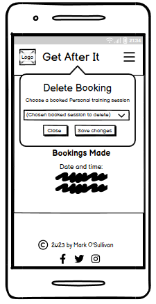
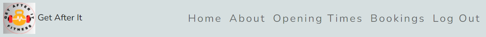
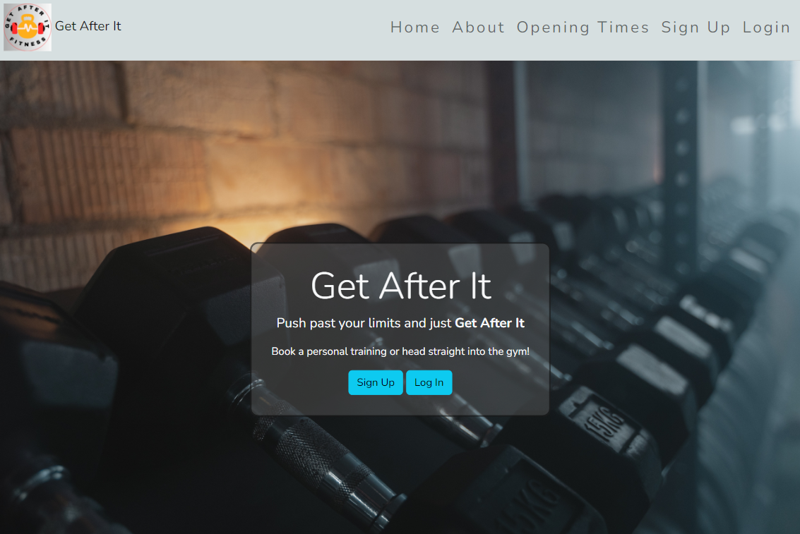

# **Get After It - Project Portfolio 4**

This is a gym website in which members can book a limited space personal training sessions.

You can view the live site here: [Get After It](https://get-after-it-pp4.herokuapp.com/)

# ***Table of Contents***

- [**Get After It - Project Portfolio 4**](#get-after-it---project-portfolio-4)
- [***Table of Contents***](#table-of-contents)
- [User Experience (UX)](#user-experience-ux)
  - [Agile Methodology](#agile-methodology)
    - [Site Goals](#site-goals)
    - [User Stories](#user-stories)
  - [Wireframes](#wireframes)
    - [***Mobile wireframes***](#mobile-wireframes)
    - [Hero image](#hero-image)
    - [About](#about)
    - [Opening time](#opening-time)
    - [Book a session form](#book-a-session-form)
    - [Book session](#book-session)
    - [Edit current booking](#edit-current-booking)
    - [Delete booking](#delete-booking)
    - [Sign up](#sign-up)
    - [Login](#login)
    - [***Desktop wireframes***](#desktop-wireframes)
    - [Hero image](#hero-image-1)
    - [About](#about-1)
    - [Opening time](#opening-time-1)
    - [Book a session form](#book-a-session-form-1)
    - [Book session](#book-session-1)
    - [Edit current booking](#edit-current-booking-1)
    - [Delete booking](#delete-booking-1)
- [Features](#features)
  - [Navigation](#navigation)
  - [Login](#login-1)
  - [Sign Out](#sign-out)
  - [Home page](#home-page)
  - [About](#about-2)
  - [Opening Times](#opening-times)
  - [Booking session](#booking-session)
- [Technologies Used](#technologies-used)
  - [Languages](#languages)
  - [Frameworks \& Software](#frameworks--software)
- [Testing](#testing)
  - [Validation](#validation)
    - [HTML Validation](#html-validation)
    - [CSS Validation](#css-validation)
  - [Manual Testing](#manual-testing)
  - [Bugs](#bugs)
- [Deployment](#deployment)
  - [Deployment to Heroku](#deployment-to-heroku)
  - [How to fork the Repo on GitHub](#how-to-fork-the-repo-on-github)
- [Credits](#credits)
  - [Content](#content)
  - [Acknowledgements](#acknowledgements)

# User Experience (UX)

## Agile Methodology

This project was planned by using Agile Methodology. This was implemented through the use of the kanban board in the project views in Github.

### Site Goals

- To provide the user with a website that will give information of the gym's opening times.
  
- To give site viewers the option to register and become members if they choose to do so.
  
- To allow members of the gym to book/edit/cancel personal training sessions online.

### User Stories

- As a user, I can view the page in its entirety and be able to use the navigation bar to easily access the main content of the page.
  
- As a user, I want to be able to register to become a member.
  
- As a user, I want to be able to log in if I am already a member.
  
- As a member, I want to be able to book Personal Training sessions.
  
- As a member, I want to be able to delete my current bookings if I want to cancel it.
  
- As a member, I want to be able to edit and change my current booking.

## Wireframes

Wireframes for the website was created using [Balsamiq](https://balsamiq.com/wireframes/).

### ***Mobile wireframes***

### Hero image

### About

### Opening time

### Book a session form

- This box only appears at the bottom if the user logged in.

### Book session

### Edit current booking

### Delete booking

### Sign up

### Login

### ***Desktop wireframes***

### Hero image

### About

### Opening time

### Book a session form

### Book session

### Edit current booking

### Delete booking

**[Back to Top](#table-of-contents)**

# Features

## Navigation

- The navigation bar is at the top of each page. It displays the logo and name of the website on the top left.
- The navigation bar also contains a button that allows the user to register/login and to book a session depening on if the user is currently logged in or not.

## Login 

## Sign Out

## Home page

- This section contains the main content of the website.
- This section allows the option for the user to either Register or Log In.
- This section provides information regarding the opening times.

## About 

## Opening Times

## Booking session

- This section is for registered members and it allows them to book session timeslots.

- It allows members with a current booking to edit their booking.

- It allows members with a current booking to delete their booking.

**[Back to Top](#table-of-contents)**

# Technologies Used

## Languages

- [HTML5](https://en.wikipedia.org/wiki/HTML5#:~:text=HTML5%20is%20a%20markup%20language,as%20the%20HTML%20Living%20Standard.) - Used to structure the content and structure for the website.
- [CSS](https://en.wikipedia.org/wiki/CSS) - Used in styling for the website.
- [Python](https://en.wikipedia.org/wiki/Python_(programming_language)) - Used in providing functionality for the website e.g. Checking if a user is trying update a slot that is already booked.
- [JavaScript](https://en.wikipedia.org/wiki/JavaScript) - Used in enhancing user experience e.g. When a user is booking a session.

## Frameworks & Software

- [Bootstrap](https://en.wikipedia.org/wiki/Bootstrap_(front-end_framework)) - A CSS framework that aids in building responsive, mobile-first websites.
- [Django](https://en.wikipedia.org/wiki/Django_(web_framework)) - A python model view template framework.
- [Balsamiq](https://balsamiq.com/wireframes/?gad=1&gclid=EAIaIQobChMI-83pjvrI_wIVRMDtCh291g9yEAAYASAAEgJkRvD_BwE) - Used in creating wireframes for the website.
- [Cloudinary](https://cloudinary.com/) - SaaS used to host image files in the project.
- [GitHub](https://github.com/) - A code hosting platform for version control, collaboration and management of the project board.
- [Codeanywhere](https://codeanywhere.com/signin) - A cross-platform cloud IDE similar to GitHub used for version control and collaboration.
- [Heroku](https://www.heroku.com/) - A cloud platform in which the application is deployed to.
- [Canva](https://www.canva.com/) - A design tool used to choose colours for the website.
- [Fontawesome](https://fontawesome.com/) - Used for footer icons of the website.
- [HTML Validator](https://validator.w3.org/) - Used to validate HTML code.
- [CSS Validator](https://jigsaw.w3.org/css-validator/) - Used to validate CSS code.
- [JSHint](https://jshint.com/) - Used to validate JavaScript.
- [Pexels](https://www.pexels.com/) - Free copyright image website in which the hero image was sourced from.

**[Back to Top](#table-of-contents)**

# Testing

## Validation

### HTML Validation
HTML validation was completed by going to <https://validator.w3.org/>

### CSS Validation
CSS validation was completed by going to <https://jigsaw.w3.org/css-validator/>

**[Back to Top](#table-of-contents)**

## Manual Testing

- Browser Compatibility:

Browser | Outcome | Pass/Fail 
 --- | --- | ---
Google Chrome | No appearance, responsiveness or functionality issues.| Pass
Safari | No appearance, responsiveness or functionality issues. | Pass
Microsoft Edge | No appearance, responsiveness or functionality issues. | Pass
Firefox | No appearance, responsiveness or functionality issues. | Pass

- Device compatibility:

Device | Outcome | Pass/Fail
--- | --- | ---
Laptop | No appearance, responsiveness nor functionality issues. | Pass
Samsung S10+ | No appearance, responsiveness nor functionality issues. | Pass

- Nav Bar (When user is not logged in)

| Input | Output | Pass/Fail |
|--- | --- | --- |
| Clicked on Home in navigation bar | The page refreshed | Pass
| Clicked on sign up in navigation bar | It went to the registration page | Pass
| Clicked on Login in navigation bar | It went to the login page | Pass

- Nav Bar (When user is logged in)

| Input | Output | Pass/Fail |
|--- | --- | --- |
| Clicked on Home in navigation bar | It refreshed the page | Pass
| Clicked Bookings in navigation bar | Redirected to book a pt session | Pass
| Clicked Log Out in navigation bar | Prompted to see if I am sure that I want to sign out | Pass
| Confirm click to log out | Fully logged out and redirected into the home page | Pass

**[Back to Top](#table-of-contents)**

## Bugs

Bug 1:

When the user creates a personal training session, they can chose a time 12PM for the session if it's available. The date with 12pm as the time booked is displayed as noon. This data is fetched from the Django Personal Training model. It is a datetime type and when it renders on the template, it's displayed in a month, day, year, time format. When a session was booked at 12pm, it was retrieved and displayed with the word noon.

The bug was discovered from the Django debug log when the button Save Changes was clicked which sends a request to the /update_personal_training_session url. The function formatting the date time couldn't format the date and time as the datetime library was being used to format it and couldn't since the word 'noon 'was part of the input.

The code formatting the date and time failed to process noon as it was initially only accounting for integer types followed by 'a.m' or 'p.m'.

As noon is the only word representing time from creating a session, the code was updated to check if there was a.m. or p.m. If not, this indicated that it was a noon. Then 12PM was directly inserted as part of the date to be formatted. This fixed the issue and the user is able to update the time for a session that is at noon/12PM.

**[Back to Top](#table-of-contents)**

Bug 2:

An update to the model file for Personal Training page was made to display the datetimes as the title for each data object  on the admin page. When trying to display the Personal Training data objects on the Django administration page,  this error was received. The type trying to be displayed is datetime object where as it should be a string.

The code that created this issue was the string representation method. It was returning a datetime model instead of a string of the datetime value.

The fix was using the string converter to convert the datetime object value to a string.

**[Back to Top](#table-of-contents)**

Bug 3:

There was no error in checking what's happening to prevent duplicate bookings from occurring. This meant that a user could have more than one booking at the same date and time.

This code was retrieving all bookings for a user, but it was not accounting for a duplicate booking. This meant more than one booking with the same date and time would get updated.

To fix this issue, a booking was retrieved by its primary key to ensure only one booking was being retrieved and updated with the new date time. If there was more than one booking returned from the get data model method, it would return an empty object to prevent any duplicate updates from happening.

**[Back to Top](#table-of-contents)**

# Deployment

## Deployment to Heroku

The project was deployed to [Heroku](https://www.heroku.com/).

1. Go to Heroku.
2. Click 'New' and select 'Create a new app'.
3. Type your app name and create app.
4. Head to 'Settings'.
5. Install the necessary buildpacks.
6. Select Python and then install node.js and install and click save. It must be done in this order.
7. Head to the 'Deploy' section.
8. Connect to your GitHub, search for your repo and confirm.
9. Choose branch to deploy.
10. Your app should now be available to see. You can choose whether to have your app automatically redeploy with every push or to keep it manual.

## How to fork the Repo on GitHub

A copy of the GitHub Repository can be created by forking the GitHub account. Changes can be made on this copy without affecting the original repository.

1. Login to GitHub and then locate the repository that you want to fork.
2. Click the fork button, this can be found in the top-right corner of the page.
3. Once this button is clicked, it creates a copy of the original repository in your GitHub.

**[Back to Top](#table-of-contents)**

# Credits

## Content

- [Balsamiq](https://balsamiq.com/wireframes/?gad=1&gclid=EAIaIQobChMI0JuG84rJ_wIVE-7tCh2fbQJKEAAYASAAEgJL1PD_BwE) was used in creating the wireframes of the website.
- [Pexels](https://www.pexels.com/) was used in the sourcing of a free copyright image for my hero image in the main page.
- [Cloudinary](https://cloudinary.com/) was used for storing my hero image.
- [W3Schools](https://www.w3schools.com/)
- [Stack Overflow](https://stackoverflow.com/)
- [Google](https://www.google.com/)

## Acknowledgements

This website was created for Portfolio Project #4 (Full-Stack-Toolkit) - Diploma in Full Stack Software Development with [Code Institute](https://codeinstitute.net/ie/).

A special thanks to my partner Gaby, for all her support while I am going through this course and (trying to) balance having a full time job and other commitments.

**[Back to Top](#table-of-contents)**
